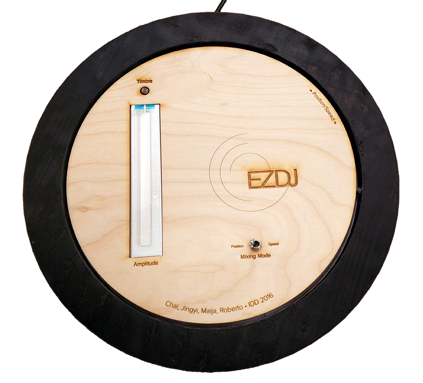

# ezdj
is a controller for mixing music. A soft pot controls the amplitude, a photoresistor the timbre, and a flex sensor the position/speed of playback, whose mode is toggled by a switch.

Included in this repo are CAD files (3D print the base and ring) and an AI file to laser cut the top, as well as the .maxpatch for  sound playback.

Demo video: https://youtu.be/USDfAa88gBw
